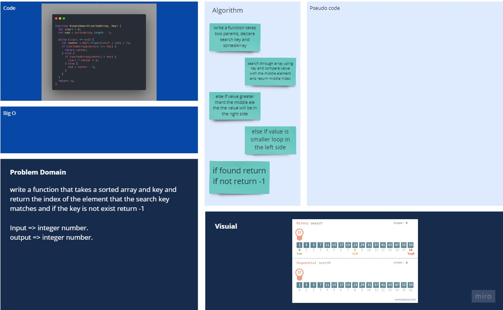

# Binary Search of Sorted Array

write a function that takes a sorted array and key and return the index of the element that the search key matches and if the key is not exist return -1

## Whiteboard Process

## Approach & Efficiency

- complixety: O(log N)
