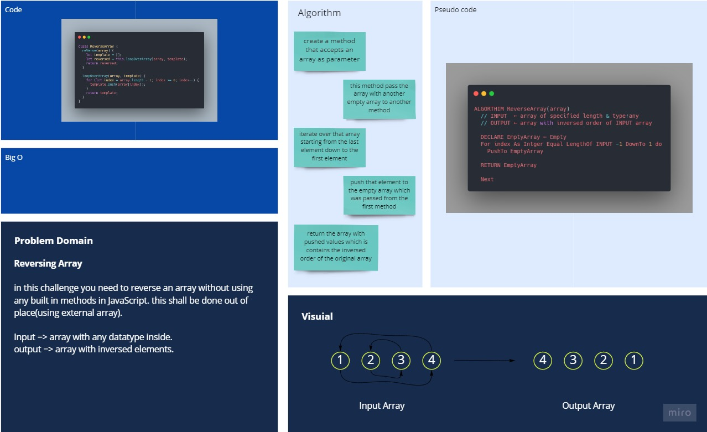

# Reverse an Array

takes an array as argument and produces a new array that the same elements in inverse order.

## Whiteboard Process

you can have a better view from [here](https://miro.com/app/board/o9J_lEC29Fs=/)

## Approach & Efficiency
