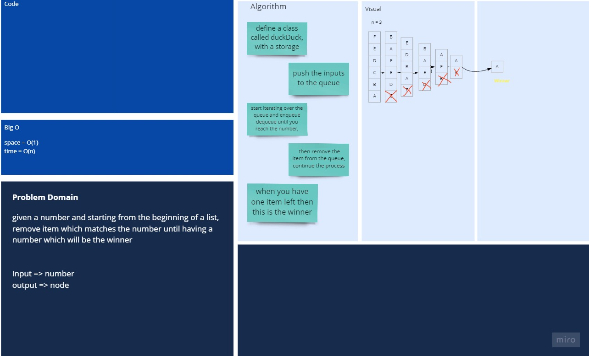
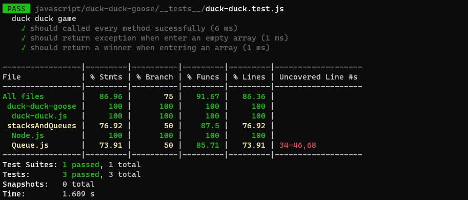

# Duck Duck Goose Game

## Challenge

In this challenge, given a string and a number, and looping from the begining, remove the item which it's index equal the entered number until you end up with one item.

## Approach & Efficiency

- Space : O(n)
- Time : O(n)

## API

- `duckDuckGoose()`: takes list of intgers and a step, return the winner from that list
- `inputs()`: enqueue the items from the array to the queue.
- `takeGoose()`: takes the step and dequeue from the queue and enqueue and dequeue the item with index equal to the step

## white Board


[Better View](https://miro.com/app/board/o9J_lBXHPlU=/)

## files structure

```shell
.
├── README.md
├── __tests__
│   └── duck-duck.test.js
└── duck-duck.js

```

## Code

```javascript
class DuckDuck {
  constructor() {
    this.queue = new Queue();
    this.temp = "";
    this.iteration = 0;
  }
  duckDuckGoose(array, iteration) {
    if (array.length !== 0) {
      this.iteration = iteration;
      this.inputs(array);
    } else {
      return "input list string should have values";
    }
    while (this.queue.size() !== 1) {
      this.takeGoose(this.iteration);
    }
    return `winner is ${this.queue.dequeue().value}`;
  }
  inputs(array) {
    for (let index = 0; index < array.length; index++) {
      this.queue.enqueue(array[index]);
    }
  }
  takeGoose(number) {
    //0-2
    for (let index = 0; index < number - 1; index++) {
      this.temp = this.queue.dequeue();
      this.queue.enqueue(this.temp.value);
    }
    this.queue.dequeue();
  }
}
```

## Test & Validation


