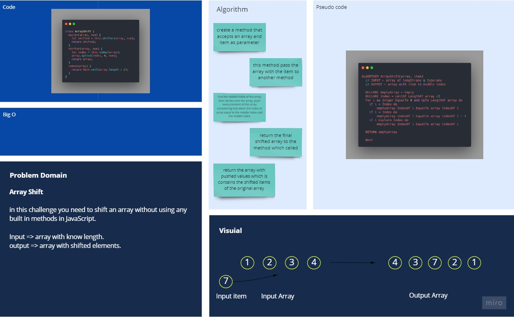

# Mock Interviews: Fabonacci Sequence

Generate the nth Fibonacci number, 2 different ways. familiarize yourself with the [Fibonacci Sequence](https://www.mathsisfun.com/numbers/fibonacci-sequence.html)

## Whiteboard Process

you can have a better view from [here](https://miro.com/app/board/o9J_lD82GBo=/)

