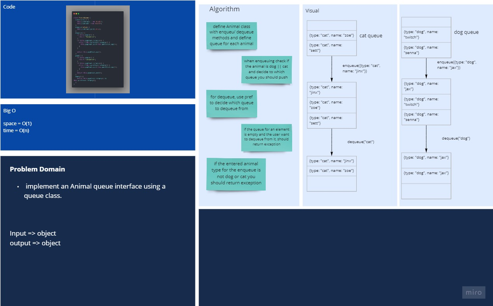
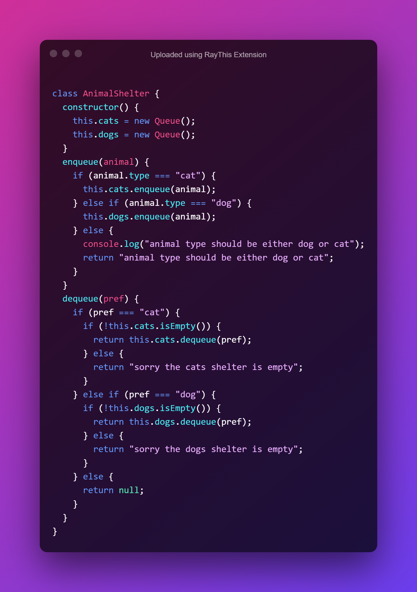
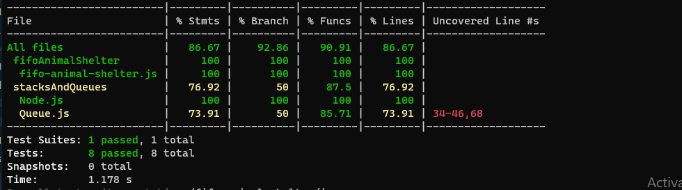

# Queue with stack

## Challenge

First-in, First out Animal Shelter.

## Approach & Efficiency

- Space : O(1)
- Time : O(n)

## API

1. Stack

2. ## Queue
   - `enqueue(animal)`: add element to the queue of dog || cat.
   - `dequeue(pref)`: it will remove the first element enqueued to the queue of dog || cat.

## white Board

[Better View](https://miro.com/app/board/o9J_lB-RP_k=/)

## code

## Tests & coverage

