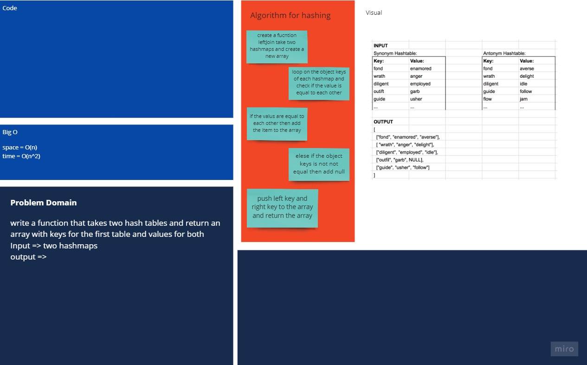

# Hashmap LEFT JOIN

an operation that combines two data tables into one table, based on matching column values. The simplest way of implementing this operation is the nested loop join algorithm, but a more scalable alternative is the hash join algorithm.

## Challenge

- Write a function that LEFT JOINs two hashmaps into a single data structure.
- The first parameter is a hashmap that has word strings as keys, and a synonym of the key as values.
- The second parameter is a hashmap that has word strings as keys, and antonyms of the key as values.
- Combine the key and corresponding values (if they exist) into a new data structure according to LEFT JOIN logic.
- LEFT JOIN means all the values in the first hashmap are returned, and if values exist in the “right” hashmap, they are appended to the result row. If no values exist in the right hashmap, then some flavor of NULL should be appended to the result row.
- The returned data structure that holds the results is up to you. It doesn’t need to exactly match the output below, so long as it achieves the LEFT JOIN logic.
- Avoid utilizing any of the library methods available to your language.

## Approach & Efficiency

- Space: O(n).
- Time: O(n^2)

## Solution

```javascript
function leftJoin(leftHashmap, rightHashmap) {
  if ((leftHashmap && !rightHashmap) || (!leftHashmap && rightHashmap)) {
    return null;
  }
  let arrOfJoin = [];
  for (
    let leftPointer = 0;
    leftPointer < Object.keys(leftHashmap.table).length;
    leftPointer++
  ) {
    let leftKey = Object.values(leftHashmap.table)[leftPointer].head.value.key;
    let leftValue = Object.values(leftHashmap.table)[leftPointer].head.value
      .value;
    for (
      let rightPointer = 0;
      rightPointer < Object.keys(rightHashmap.table).length;
      rightPointer++
    ) {
      let rightKey = Object.values(rightHashmap.table)[rightPointer].head.value
        .key;
      let rightValue = Object.values(rightHashmap.table)[rightPointer].head
        .value.value;
      if (leftKey === rightKey) {
        arrOfJoin.push([leftKey, leftValue, rightValue]);
        break;
      } else if (rightPointer === Object.keys(rightHashmap.table).length - 1) {
        arrOfJoin.push([leftKey, leftValue, null]);
      }
    }
  }
  return arrOfJoin;
}
```

## Whiteboard


[better view](https://miro.com/app/board/o9J_l8sjDxM=/)

## Test


