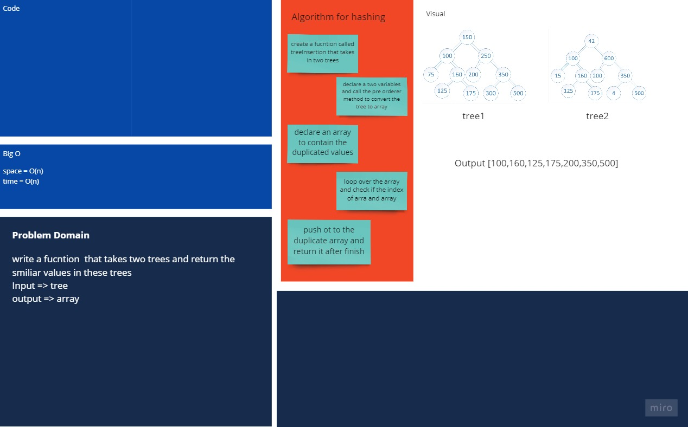

# Tree Intersection

Given two Binary Search Trees, find common nodes in them. In other words, find intersection of two BSTs

## Challenge

Write a function called treeInterSection that takes two binary tree parameters.

Without utilizing any of the built-in library methods available to your language, return a set of values found in both trees.

## Approach & Efficiency

Space : O(n)
Time : O(n)

## whiteboard

