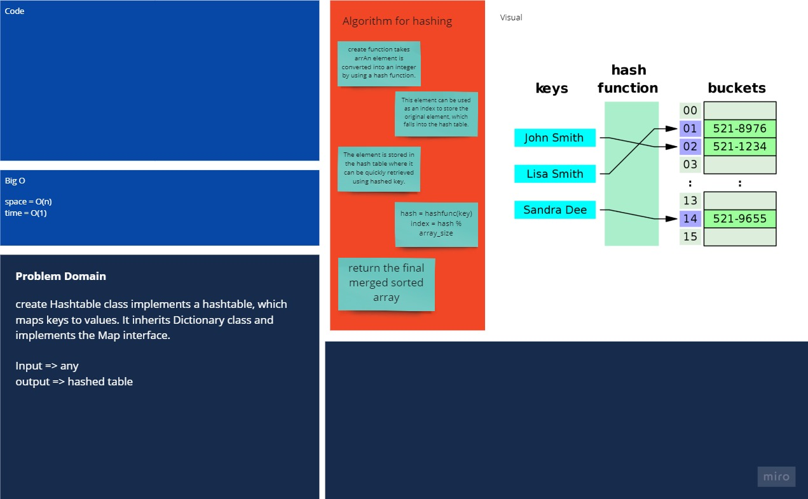

# Hash Table

Hashtable is an array of a list. Each list is known as a bucket. The position of the bucket is identified by calling the `hashcode()` method. A Hashtable contains values based on the key.

## Problem Domain

create Hashtable class implements a hashtable, which maps keys to values. It inherits Dictionary class and implements the Map interface.

## whiteboard

