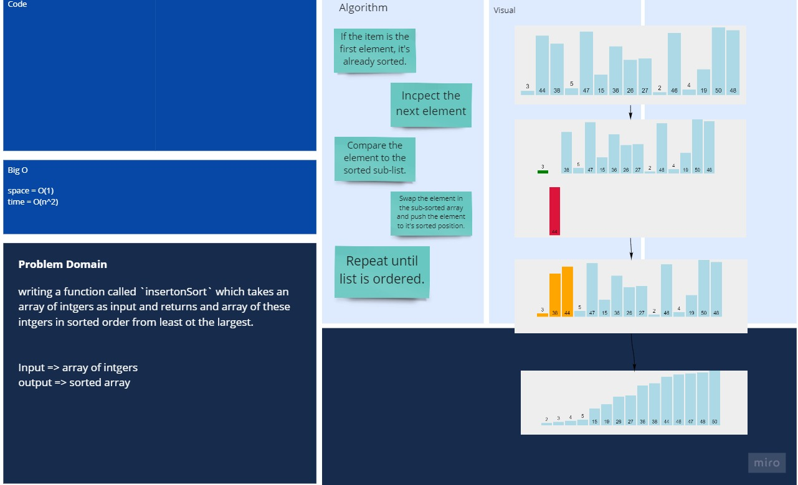

## Insertion Sort

Insertion sort is a simple sorting algorithm that builds the final sorted array one item at a time. It is much less efficient on large lists than more advanced algorithms such as quicksort, or merge sort.

## Challenge

- Provide a visual step through for each of the sample arrays based on the provided pseudo code
- Convert the pseudo-code into working code in your language
- Present a complete set of working tests

## Whiteboard

