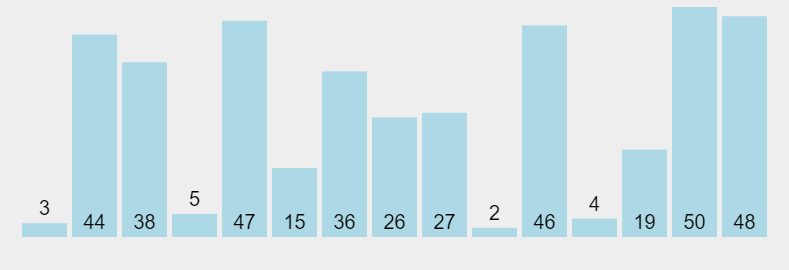
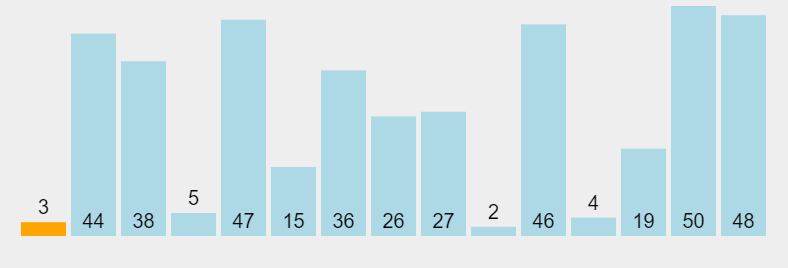
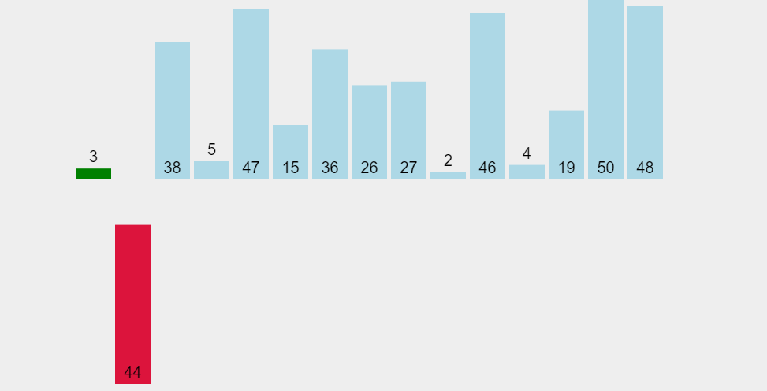
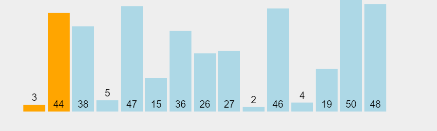
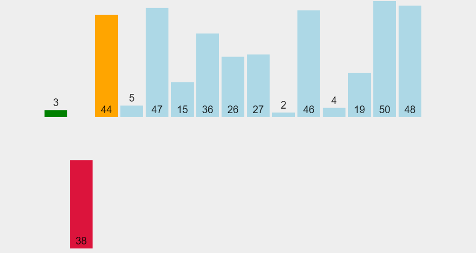
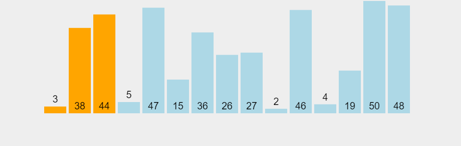
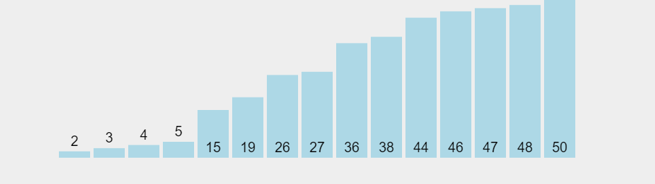
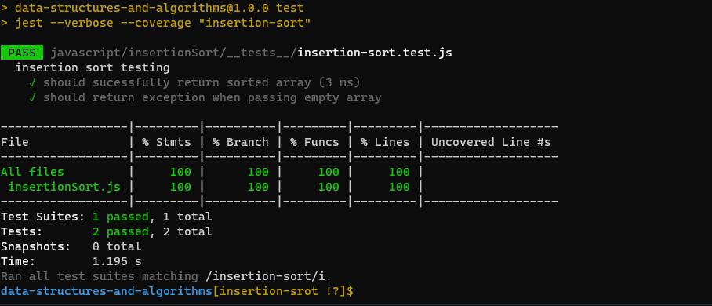

# Insertion Sort

This blog post is written upon a task required in code fellows data-structures-and-algorithms javascript daily challenges.

In this blog post i will focus on Insertion Sort. I will explain what is insertion sort and try to break down the concept of insertion sort step by step and providing the code, visiulizition and test for it.

before going further, I will introduce myself. I am Ibrahim Banat a full stack web developer, specialized in MERN stack. I just finished a bootcamp in web development from code fellows and sponsered by ASAC.

## what is insertion sort ?

Insertion sort is the simple sorting algorithm which is commonly used in the daily lives while ordering a deck of cards. In this algorithm, we insert each element onto its proper place in the sorted array. This is less efficient than the other sort algorithms like quick sort, merge sort, etc. [source](https://www.javatpoint.com/insertion-sort)

## Problem domain

writing a function called `insertonSort` which takes an array of intgers as input and returns and array of these intgers in sorted order from least ot the largest.

## Algorithm

The `insertonSort` method works by building up a sorted array with the first element, then looking to the next element, if it's less that the previous elements, it swaps the element backwards until it's in sorted position. it continue iterating through the input list, swapping new items backwards into sorted position until it reache the end.

in conclusion:

1. If the item is the first element, it's already sorted.
2. Incpect the next element
3. Compare the element to the sorted sub-list.
4. Swap the element in the sub-sorted array and push the element to it's sorted position.
5. Repeat until list is ordered.

## Pseudocode

```
InsertionSort(int[] arr)

    FOR i = 1 to arr.length

      int j <-- i - 1
      int temp <-- arr[i]

      WHILE j >= 0 AND temp < arr[j]
        arr[j + 1] <-- arr[j]
        j <-- j - 1

      arr[j + 1] <-- temp

```

## Visialization

- why we need visualization for data structures?

> Consequently exercises in computer science
> should also be supported not only by giving feedback
> to the program code, but also by visualizing objects
> and data structures produced by the program code
> created by learners. These visualizations of each
> individual solution would be an important link
> between contents of the course and feedback for
> exercises. Moreover, they can help learners in
> debugging their program code, because an image
> of the data structure may give them some useful
> information without any need for inserting debug
> statements into their program code.
>
> VISUALIZING DATA STRUCTURES IN AN E-LEARNING SYSTEM, M.Striewe & M.Goedicke [source](https://www.scitepress.org/papers/2010/27738/27738.pdf)

- for the visualizations, i am using a cool website called [visualgo](https://visualgo.net/).

first thing first, this is our input list of intgers:



we will pass this list to the method, and the method will return a sorted copy of this list, we will come later to the impelmentation of the code.

Now we will take the first element, and since it's the first element, it's already sorted.



moving to the next element, which is (44), figure where to insert this extracted element; comparing with sorted sub-list which contains (3).



becasue (44) is not smaller than (3) then insert the lement at the current position. the sub-sorted list should look like this:



now we will excract the first un-sorted element which is (38). by comparing 38 to the last element in the sub-sorted list and since 38 is less than 44 then we will do a swap.



and now figure where to insert extracted element; comparing with sorted element 3. becasue 38 is not less than 3 then we will insert it at currenct position. the sub-sorted list should look like this:



the algorithm will continue looping until it sort all of the element in the array.

the final sorted array should look like:



now after showin a visiulizition for the inseration sort, we will move to an important thing, which makes other sorting algorthims better than insertioin sort, it's the Big(O) notation.

## Big(O) notation

[Big O](https://adrianmejia.com/algorithms-for-dummies-part-1-sorting/#Big-O-Notation) is defined as the asymptotic upper limit of a function. In plain english, it means that is a function that cover the maximum values a function could take. As we saw a little earlier this notation help us to predict performance and compare algorithms.

| Growth Rate | Name         |
| ----------- | ------------ |
| 1           | Constant     |
| log(n)      | Logarithmic  |
| n           | Linear       |
| n log(n)    | Linearithmic |
| n^2         | Quadratic    |
| n^3         | Cubic        |
| 2^n         | Exponential  |

what makes insertion sort terrable is that it takes quadratic growth rate becasue it contains nested loops.

the [running times](https://www.khanacademy.org/computing/computer-science/algorithms/insertion-sort/a/analysis-of-insertion-sort) for insertion sort:

- Worst case: O(n^2).
- Best case: O(n).
- Average case for a random array: O(n^2).
- "Almost sorted" case: O(n).

now we will move to the implementation insertion sort in javascript.

## Implementation

1. first of all we will create our function `insertSort`.

```javascript
function insertSort(array) {
  //creating insertion sort function
}
```

2. we will through the array starting form the index of `1` becasue as we said the first element is already sorted.

```javascript
function insertSort(array) {
  for (let item = 1; item < array.length; item++) {
    //looping through the input list
  }
}
```

3. now we will loop over the sub-sorted array from the last element until we reach the first element to make sure that we positioned our element correctly.

```javascript
function insertSort(array) {
  for (let item = 1; item < array.length; item++) {
    for (let index = item; index > 0; index--) {
      //looping through the sub-sorted array down
      //to the first eleemnt
    }
  }
}
```

4. now we will compare if the current item in the ainput array is less than the previous item, then we will store the current item in a temp variable and swap it with the previous item.

```javascript
function insertSort(array) {
  for (let item = 1; item < array.length; item++) {
    for (let index = item; index > 0; index--) {
      if (array[index] < array[index - 1]) {
        const temp = array[index];
        array[index] = array[index - 1];
        array[index - 1] = temp;
      }
    }
  }
}
```

5. we will keep loop over the sub-sorted array until the current item reaches it's sorted postion. and we will break the loop for the sub-sorted array.

```javascript
function insertSort(array) {
  for (let item = 1; item < array.length; item++) {
    for (let index = item; index > 0; index--) {
      if (array[index] < array[index - 1]) {
        const temp = array[index];
        array[index] = array[index - 1];
        array[index - 1] = temp;
      } else {
        break;
      }
    }
  }
}
```

6. final step we will return the array, which will be modified to be sorted.

```javascript
function insertSort(array) {
  for (let item = 1; item < array.length; item++) {
    for (let index = item; index > 0; index--) {
      if (array[index] < array[index - 1]) {
        const temp = array[index];
        array[index] = array[index - 1];
        array[index - 1] = temp;
      } else {
        break;
      }
    }
  }
  return array;
}
```

in conclusion: the implementation of the algorthim looks like:

```javascript
"use strict";

/**
 * takes an array of intgers as input and returns
 * and array of these intgers in sorted order from least ot the largest
 * @param {Array} array of intgers
 * @returns Array of sorted intgers
 */

function insertSort(array) {
  for (let item = 1; item < array.length; item++) {
    for (let index = item; index > 0; index--) {
      if (array[index] < array[index - 1]) {
        const temp = array[index];
        array[index] = array[index - 1];
        array[index - 1] = temp;
      } else {
        break;
      }
    }
  }
  return array;
}

module.exports = insertSort;
```

i exported the function to use it inside the tests files.

## Testing and Validation

i used [JEST] library which is created by facebook, first of all i have imported the method which i exported earlier, and then i tested if the function returns a sorted array or not.
i have tested also the length of the output array which should not be changed.

```javascript
"use strict";

const insertionSort = require("../insertionSort");

describe("insertion sort testing", () => {
  it("should sucessfully return sorted array", () => {
    //arrange
    let array = [8, 4, 23, 42, 16, 15];
    //act
    let sorted = insertionSort(array);
    //assert
    expect(sorted.length).toEqual(6);
    expect(sorted[0]).toEqual(4);
    expect(sorted).toEqual([4, 8, 15, 16, 23, 42]);
  });
});
```

after that we need to think about an edge case, if the input array is empty.
in this case we need to add a condition which returns exception if the input array was empty.

```javascript
if(array.length === 0) {
    retrun 'Exception';
}
```

our method should look like this:

```javascript
"use strict";

/**
 * takes an array of intgers as input and returns
 * and array of these intgers in sorted order from least ot the largest
 * @param {Array} array of intgers
 * @returns Array of sorted intgers
 */

function insertSort(array) {
  if (array.length === 0) {
    return "Exception";
  }

  for (let item = 1; item < array.length; item++) {
    for (let index = item; index > 0; index--) {
      if (array[index] < array[index - 1]) {
        const temp = array[index];
        array[index] = array[index - 1];
        array[index - 1] = temp;
      } else {
        break;
      }
    }
  }
  return array;
}

module.exports = insertSort;
```

now if we want to test our method, we should pass an empty array to our method and expecting 'Exception' from it.

```javascript
it("should return exception when passing empty array", () => {
  //arrange
  let arr = [];
  //act
  let sorted = insertionSort(arr);
  //assert
  expect(sorted).toEqual("Exception");
});
```

and it sucessfully worked as expected.
this is the test coverage:



thats all for the insertioin sort, i hope you enjoyed reading this article. and see you in the next blog.
