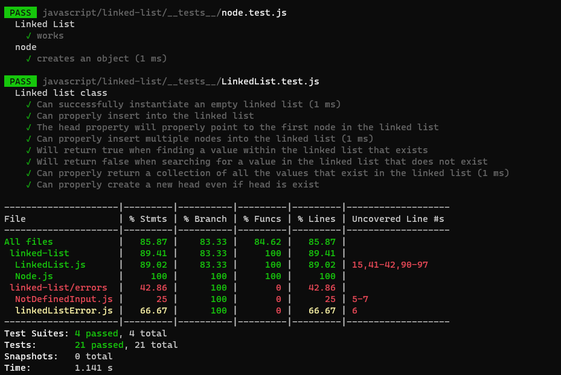

# Linked List

A linked list is a linear data structure, in which the elements are not stored at contiguous memory locations.

# Singly Linked List

Linked List can be defined as collection of objects called nodes that are randomly stored in the memory.

## Challenge

In this challenge, we wrote the implementation, testing and semantci error handling for singly linked list using ES6 clases.

## Approach & Efficiency

the approach is navigation forward only

- Space : O(1)
- Time : O(n)

## API

- `Insert()`: which takes value of type any adding new node with the input value to the list.
- `chcekForInput()`: this method is to handle check if the input is not `undefined` or infinity.
- `addNewHead()` : this method creates a new head if not exist, otherwise it's append a new head to the begining of the linked list.
- `includes()`: this method compare input value if it's exist in linked list.
- `toString()`: return a string visiulizing the linked list shape.
- `append()`: appends an new node with given calue to the end of the list.
- `insertBeafore()`: adds a new node with give value beafore specified value node.
- `kthFromEnd()`: takes k as input and return the node value for that number.

## Solution

[Link to the code](https://github.com/ibrahimBanat/data-structures-and-algorithms/blob/main/javascript/linked-list/LinkedList.js)

## white Board


[better view](https://miro.com/app/board/o9J_lCnsZhM=/)

### code


## Tests & coverage




## files structure

```shell
.
├── LinkedList.js
├── Node.js
├── README.md
├── __tests__
│   ├── LinkedList.test.js
│   ├── LinkedListInsertion.test.js
│   ├── ll-kth-from-end.test.js
│   └── node.test.js
└── errors
    ├── NotDefinedInput.js
    └── linkedListError.js
```
