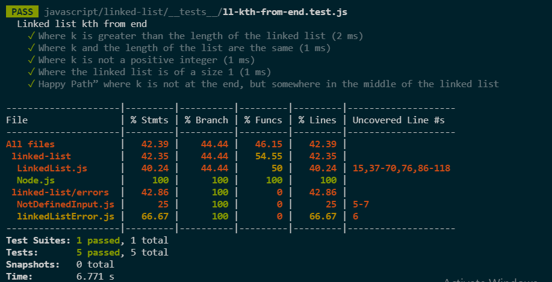

# LL-Kth from end

k-th value from the end of a linked list.

## Challenge

In this challenge, we wrote the implementation, testing and semantci error handling for ll-kth from the end

## Approach & Efficiency

the approach is navigation forward only

- Space : O(1)
- Time : O(n)

## API

- `Insert()`: which takes value of type any adding new node with the input value to the list.
- `chcekForInput()`: this method is to handle check if the input is not `undefined` or infinity.
- `addNewHead()` : this method creates a new head if not exist, otherwise it's append a new head to the begining of the linked list.
- `includes()`: this method compare input value if it's exist in linked list.
- `toString()`: return a string visiulizing the linked list shape.
- `append()`: appends an new node with given calue to the end of the list.
- `insertBeafore()`: adds a new node with give value beafore specified value node.
- `kthFromEnd()`: takes k as input and return the node value for that number.

## Solution

[Link to the code](https://github.com/ibrahimBanat/data-structures-and-algorithms/blob/main/javascript/linked-list/LikedList.js)

## white Board


[better view](https://miro.com/app/board/o9J_lBcuB2w=/)

### code

```javascript
kthFromEnd(k) {
    let nodeLooper = this.head;
    let position = this.length - 1 - k;
    let index = 0;
    while (nodeLooper) {
      if (position === index) {
        return nodeLooper.value;
      }
      nodeLooper = nodeLooper.next;
      index++;
    }
    return "Exception";
  }
```

## Tests & coverage



## files structure

```shell
.
├── LinkedList.js
├── Node.js
├── README.md
├── __tests__
│   ├── LinkedList.test.js
│   ├── LinkedListInsertion.test.js
│   ├── ll-kth-from-end.test.js
│   └── node.test.js
└── errors
    ├── NotDefinedInput.js
    └── linkedListError.js
```
