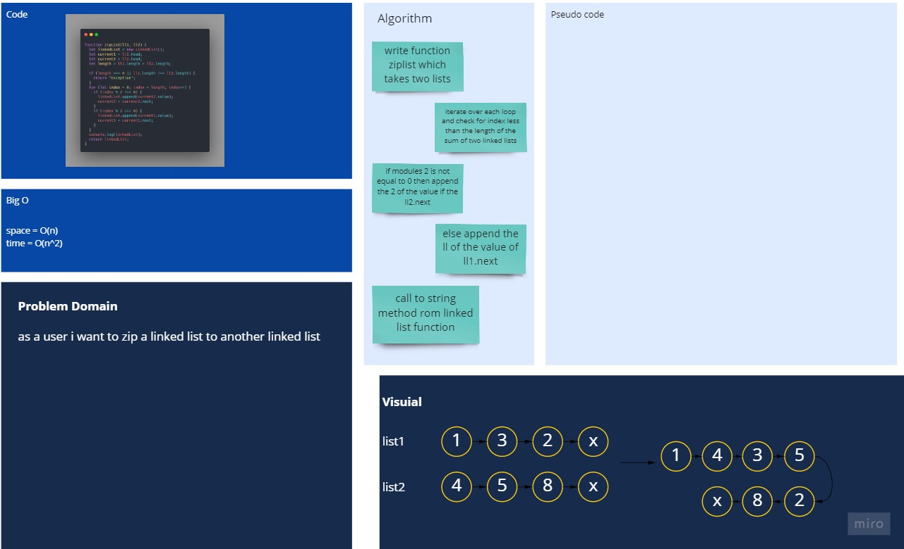

# zip linked list

## Challenge

In this challenge, we wrote the implementation and testing for zip lists which takes two linked lists and zip the two linked lists togther in one single linked list

## Approach & Efficiency

the approach is navigation forward only

- Space : O(n)
- Time : O(n^2)

## API

- `zipList()`: takes two linked lists as arguments and zip them togther so that the nodes alternate between the two lists and return a reference to the head of the zipped list.

## white Board



## files structure

```shell
├── README.md
├── ll-zip.js
└── __tests__
   └── ll-zip.test.js
```
