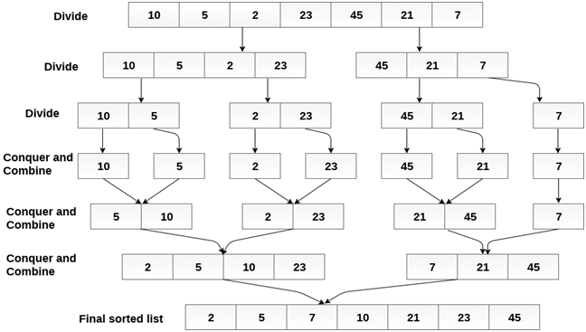
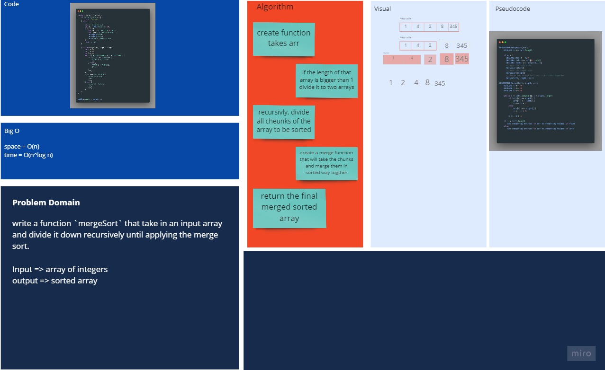

## Merge Sort

Merge sort is the algorithm which follows divide and conquer approach. The algorithm processes the elements in 3 steps.

1. If A Contains 0 or 1 elements then it is already sorted, otherwise, Divide A into two sub-array of equal number of elements.
2. Conquer means sort the two sub-arrays recursively using the merge sort.
3. Combine the sub-arrays to form a single final sorted array maintaining the ordering of the array.

## visiualization

## WhiteBoard

[better view](https://miro.com/app/board/o9J_l9yqknA=/)
