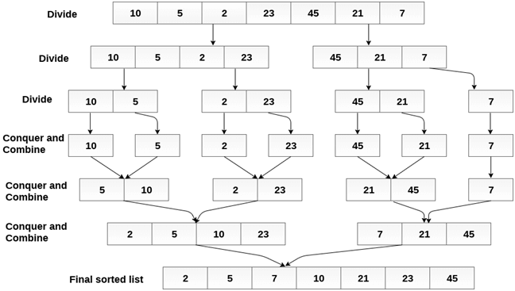

# Merge Sort

Merge sort is the algorithm which follows divide and conquer approach. Consider an array A of n number of elements. The algorithm processes the elements in 3 steps.

- If A Contains 0 or 1 elements then it is already sorted, otherwise, Divide A into two sub-array of equal number of elements.
- Conquer means sort the two sub-arrays recursively using the merge sort.
- Combine the sub-arrays to form a single final sorted array maintaining the ordering of the array.
  The main idea behind merge sort is that, the short list takes less time to be sorted.

## Complexity

| Complexity       | Best case  | Average Case | Worst Case |
| ---------------- | ---------- | ------------ | ---------- |
| Time Complexity  | O(n log n) | O(n log n)   | O(n log n) |
| Space Complexity |            |              | O(n)       |

## Example

Consider the following array of 7 elements. Sort the array by using merge sort.

```javascript
A = {10, 5, 2, 23, 45, 21, 7}
```



## Algorithm

1. If it is only one element in the list it is already sorted, return.
1. Divide the list recursively into two halves until it can no more be divided.
1. Merge the smaller lists into new list in sorted order.

## Merge Sort: An example

Here is an example of writing the Merge Sort Algorithm based on the steps I provided earlier. Below I have written a function, which accept the following parameter: an array. The function returns the sorted array.

```javascript
// Split the array into halves and merge them recursively
function mergeSort(array) {
  if (array.length === 1) {
    // Return once we hit an array with a single item
    return array;
  }

  // Get the middle item of the array rounded down by creating a variable
  const middle = Math.floor(array.length / 2);
  // Create a variable for the items on the left side
  const left = array.slice(0, middle);
  // Create a variable for the items on the right side
  const right = array.slice(middle);

  return merge(mergeSort(left), mergeSort(right));
}

// Compare the arrays item by item and return the concatenated result
function merge(left, right) {
  let result = [];
  let indexLeft = 0;
  let indexRight = 0;

  while (indexLeft < left.length && indexRight < right.length) {
    if (left[indexLeft] < right[indexRight]) {
      result.push(left[indexLeft]);
      indexLeft++;
    } else {
      result.push(right[indexRight]);
      indexRight++;
    }
  }

  return result.concat(left.slice(indexLeft)).concat(right.slice(indexRight));
}

const arrayOfNumbers = [2, 5, 1, 3, 7, 4, 2, 3, 9, 8, 6, 3];
console.log(mergeSort(arrayOfNumbers)); // [1, 2, 2, 3, 3, 3, 4, 5, 6, 7, 8, 9]
```
