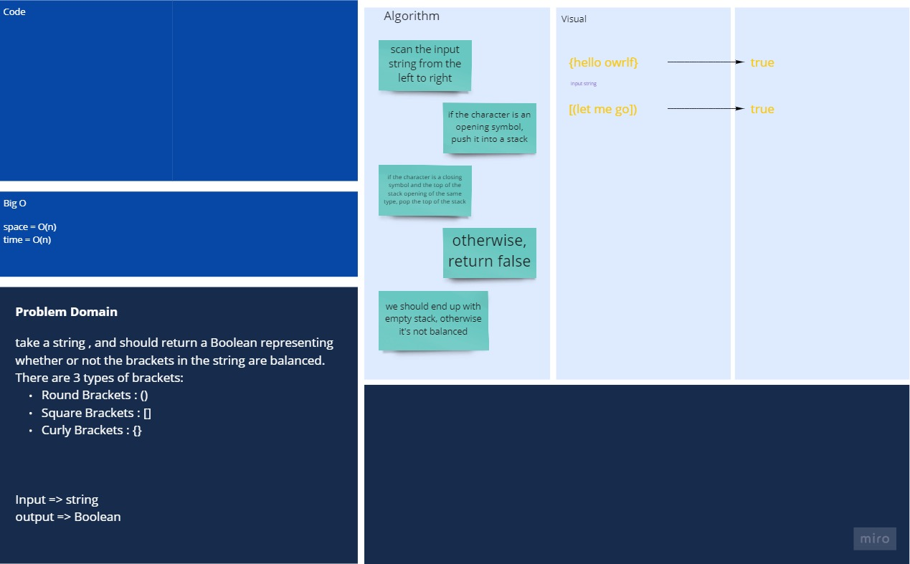
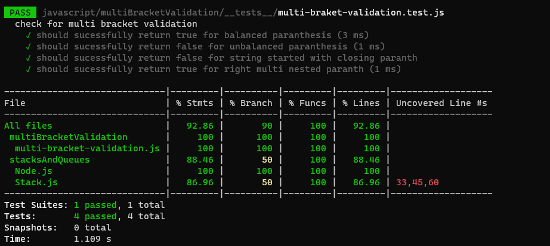

# Stack & Queues

## Challenge

In this challenge we will write the code for validating the multi-brackets pairs.

## Approach & Efficiency

- Space : O(1)
- Time : O(n)

## API

- `checkForValidation(input)`: return whether the input string is having a balanced paranthesis or not.
- `isOpening(char)`: return Boolean represents if the charcter is an opening paranthesis or not.
- `isClosing(char)`:return Boolean represents if the charcter is a closing paranthesis or not.
- `isPair(opening, closing)`: checks if the open character and the closing charcter are pairs.

## white Board


[Better View](https://miro.com/app/board/o9J_lBLr7KM=/)

## files structure

```shell
.
├── README.md
├── __tests__
│   └── multi-braket-validation.test.js
└── multi-bracket-validation.js
```

## Code

```command
class MultiBracketValidation {
  constructor() {
    this.stack = new Stack();
    this.opening = ["{", "(", "[", "<"];
    this.closing = ["}", ")", "]", ">"];
  }
  checkForValidation(input) {
    for (const char of input) {
      if (this.isOpening(char)) {
        this.stack.push(char);
      } else if (this.isClosing(char)) {
        if (
          this.stack.isEmpty() ||
          !this.isPair(this.stack.peek().value, char)
        ) {
          return false;
        } else {
          this.stack.pop();
        }
      }
    }
    return this.stack.isEmpty();
  }
  isOpening(char) {
    return this.opening.indexOf(char) >= 0;
  }
  isClosing(char) {
    return this.closing.indexOf(char) >= 0;
  }
  isPair(opening, closing) {
    return this.closing.indexOf(closing) === this.opening.indexOf(opening);
  }
}
```

## Test & Validation


