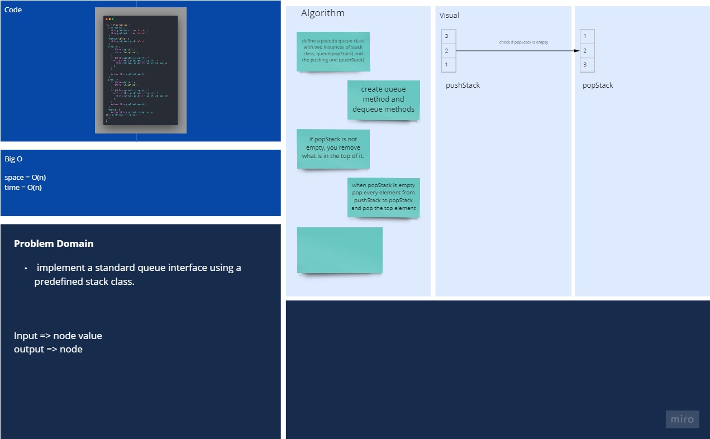
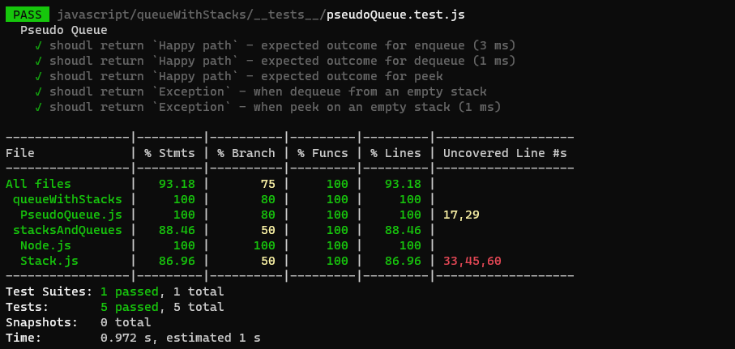

# Queue with stack

## Challenge

Implement a Queue using two Stacks.

## Approach & Efficiency

- Space : O(n)
- Time : O(n)

## API

1. Stack

   - `push()`: look at the first available index and add the element there.
   - `pop()`: remove from the top of the stack.
   - `peek()`: shows which element would be removed next, but doesnot actually remove it.
   - `size()`: it will look at the size variable.
   - `isEmpty()`: return whether or not there is an elements in the the stack.

2. ## Queue
   - `enqueue()`: add element to the queue.
   - `dequeue()`: it will remove the first element enqueued to the queue.
   - `peek()`: return the first added without removing it.
   - `empty()`: checks whether if the the queue is empty or not.

## white Board


[Better View](https://miro.com/app/board/o9J_lB36Ifk=/)

## files structure

```shell
.
├── PseudoQueue.js
├── README.md
└── __tests__
    └── pseudoQueue.test.js
```

## Tests & coverage


