# quickSort

Quick sort is the widely used sorting algorithm that makes n log n comparisons in average case for sorting of an array of n elements. This algorithm follows divide and conquer approach.

## Algorithm

1. Set the first index of the array to left and loc variable. Set the last index of the array to right variable. i.e. left = 0, loc = 0, en d = n - 1, where n is the length of the array.

2. Start from the right of the array and scan the complete array from right to beginning comparing each element of the array with the element pointed by loc.

3. Ensure that, `a[loc]` is less than `a[right]`.

   - If this is the case, then continue with the comparison until right becomes equal to the loc.
   - If `a[loc] > a[right]`, then swap the two values. And go to step 3.
   - Set, loc = right

4. start from element pointed by left and compare each element in its way with the element pointed by the variable loc. Ensure that `a[loc] > a[left]`.

   - if this is the case, then continue with the comparison until loc becomes equal to left.
   - `[loc] < a[right]`, then swap the two values and go to step 2.
   - Set, loc = left.

## visiulizaztion

Here is a visualization of the entire Quicksort process.

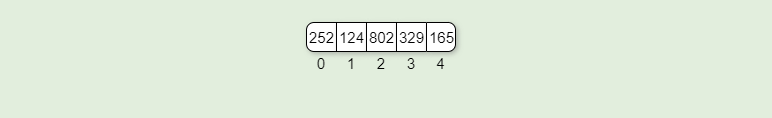

2. we will select the pivot.
   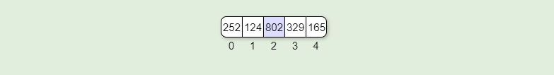

3. Move the pivot to the end.
   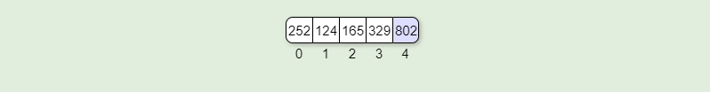

4. Partition the subarray.
   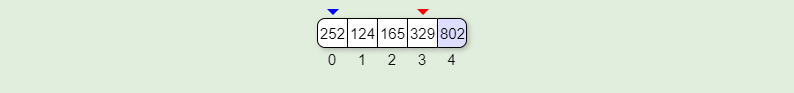

5. Move the left bound to the right until it reaches a value greater than or equal to the pivot.
   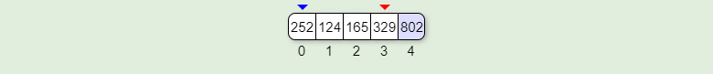

6. Step right.
   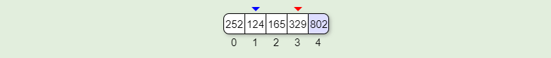

7. Move the right bound to the left until it crosses the left bound or finds a value less than the pivot.
   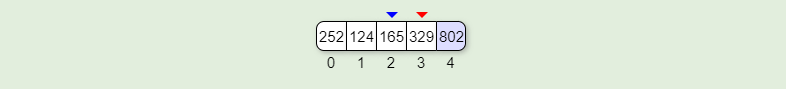

8. bounds have crossed.
   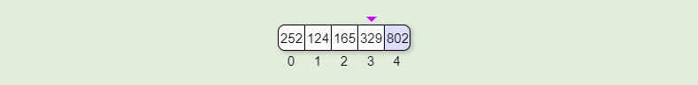

9. When the right bound crosses the left bound, all elements to the left of the left bound are less than the pivot and all elements to the right are greater than or equal to the pivot.
   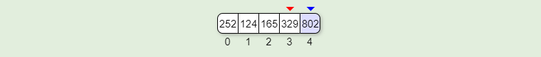

10. Move the pivot to its final location.
    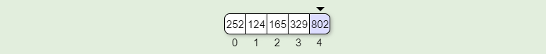

11. Call quicksort on the left sublist.
    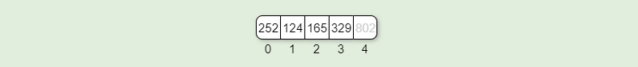

12. and the process above continues after selecting a pivot element untill we reach our sorted array
    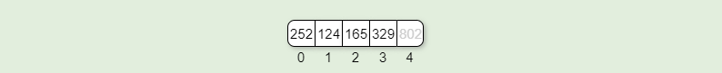

## Implementation

```javascript
"use strict";

function quickSort(array, left, right) {
  if (left < right) {
    let position = partition(array, left, right);
    quickSort(array, left, position - 1);
    quickSort(array, position + 1, right);
  }
  return array;
}

function partition(array, left, right) {
  let pivot = array[right];
  let low = left - 1;
  for (let i = left; i < right; i++) {
    if (array[i] <= pivot) {
      low++;
      swap(array, i, low);
    }
  }
}
function swap(array, i, low) {
  let temp;
  array[i] = array[low];
  array[low] = temp;
}

module.exports = quickSort;
```

## Test

```javascript
"use strict";

const quickSort = require("../quickSort");

describe("quickSort", () => {
  it("should give back expected outcome", () => {
    let arr = [8, 4, 23, 42, 16, 15];

    expect(quickSort(arr, 0, arr.length - 1)).toEqual([4, 8, 15, 16, 23, 42]);
  });
  it("Edge Case", () => {
    let arr = [1, 1, 1, 1];

    expect(quickSort(arr, 0, arr.length - 1)).toEqual([1, 1, 1, 1]);
  });
});
```

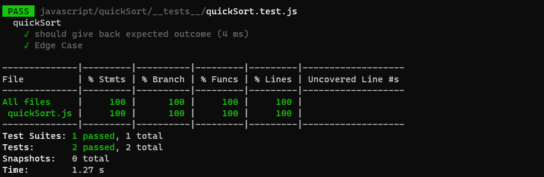
