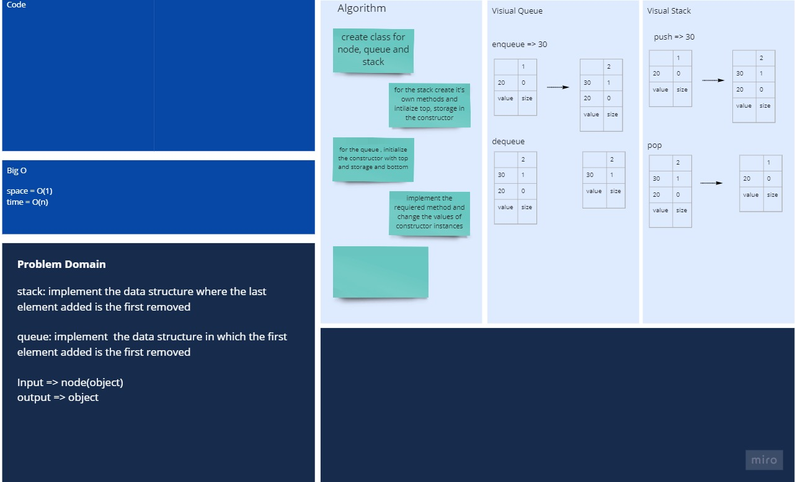
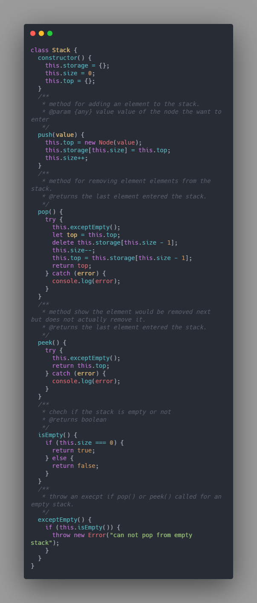
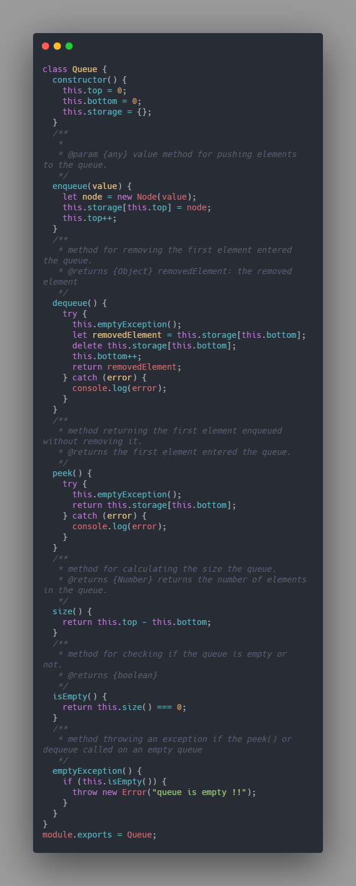
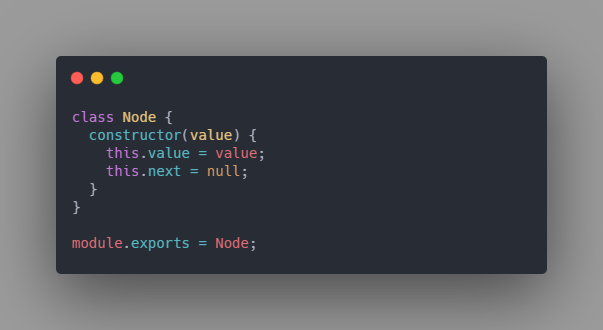

# Stack & Queues

## Challenge

In this challenge we will write the code for both queue and stack data structures.

- `Stack`: is just a data structure in which last element added is the first one will be removed.

- `Queue`: is a data structure in which first element is the first out.

## Approach & Efficiency

- Space : O(1)
- Time : O(n)

## API

1. Stack

   - `push()`: look at the first available index and add the element there.
   - `pop()`: remove from the top of the stack.
   - `peek()`: shows which element would be removed next, but doesnot actually remove it.
   - `size()`: it will look at the size variable.
   - `isEmpty()`: return whether or not there is an elements in the the stack.

2. ## Queue
   - `enqueue()`: add element to the queue.
   - `dequeue()`: it will remove the first element enqueued to the queue.
   - `peek()`: return the first added without removing it.
   - `size()`: return the size of the queue.
   - `isEmpty()`: checks whether if the the queue is empty or not.

## white Board


[Better View](https://miro.com/app/board/o9J_lBz8UcE=/)

## files structure

```shell
.
├── Node.js
├── Queue.js
├── README.md
├── Stack.js
└── __tests__
    ├── queue.test.js
    └── stack.test.js
```

## Code

1. Stack



2. Queue



3. Node


