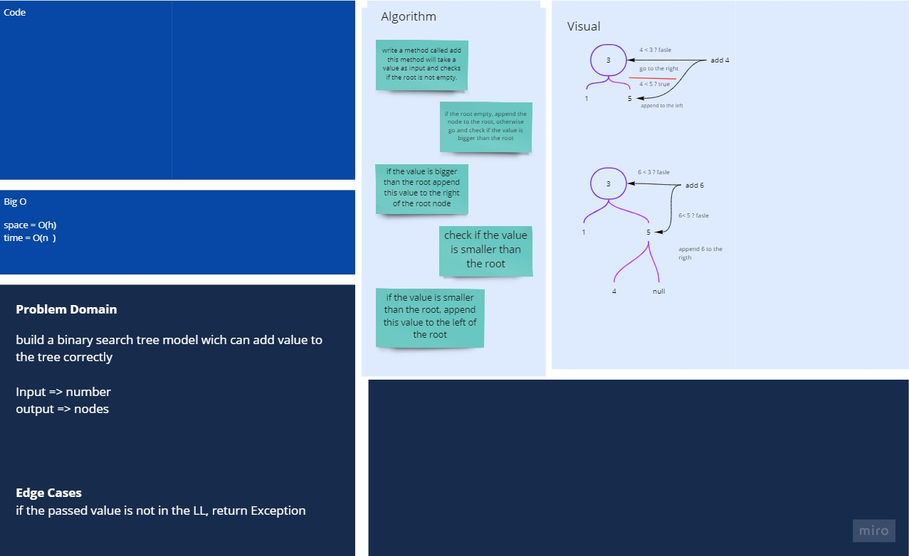

## whiteboard


[better view](https://miro.com/app/board/o9J_lAszY0M=/)

## code

```javascript
class BinarySearchTree {
  constructor(root = null) {
    this.root = root;
  }
  add(value) {
    let node = new Node(value);
    if (this.root === null) {
      this.root = node;
    } else {
      this.insertTree(this.root, node);
    }
  }
  contains(value) {
    let current = this.root;
    while (current) {
      if (current.value === value) {
        return true;
      }
      if (value < current.value) {
        current = current.left;
      } else {
        current = current.right;
      }
    }
    return false;
  }
  insertTree(root, newNode) {
    if (newNode.value < root.value) {
      if (root.left === null) {
        root.left = newNode;
      } else {
        this.insertTree(root.left, newNode);
      }
    } else if (newNode.value > root.value) {
      if (root.right === null) {
        root.right = newNode;
      } else {
        this.insertTree(root.right, newNode);
      }
    }
  }
}
```
