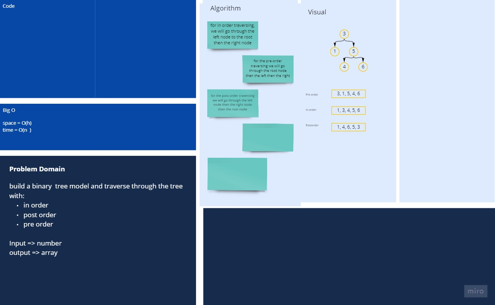

## whiteboard


[better view](https://miro.com/app/board/o9J_lAs50bQ=/)

## code

```javascript
class BinaryTree {
  constructor() {
    this.array = [];
  }
  preOrder(root) {
    //P -> L -> R
    let preOrdered;
    if (root !== null) {
      this.array.push(root.value);
      this.preOrder(root.left);
      this.preOrder(root.right);
      preOrdered = this.array;
      return preOrdered;
    }
  }
  postOrder(root) {
    //L -> R -> P
    if (root !== null) {
      this.postOrder(root.left);
      this.postOrder(root.right);
      this.array[this.array.length] = root.value;
      return this.array;
    }
  }
  inOrder(root) {
    // L -> P -> R
    if (root !== null) {
      this.inOrder(root.left);
      this.array[this.array.length] = root.value;
      this.inOrder(root.right);
      return this.array;
    }
  }
}
```
