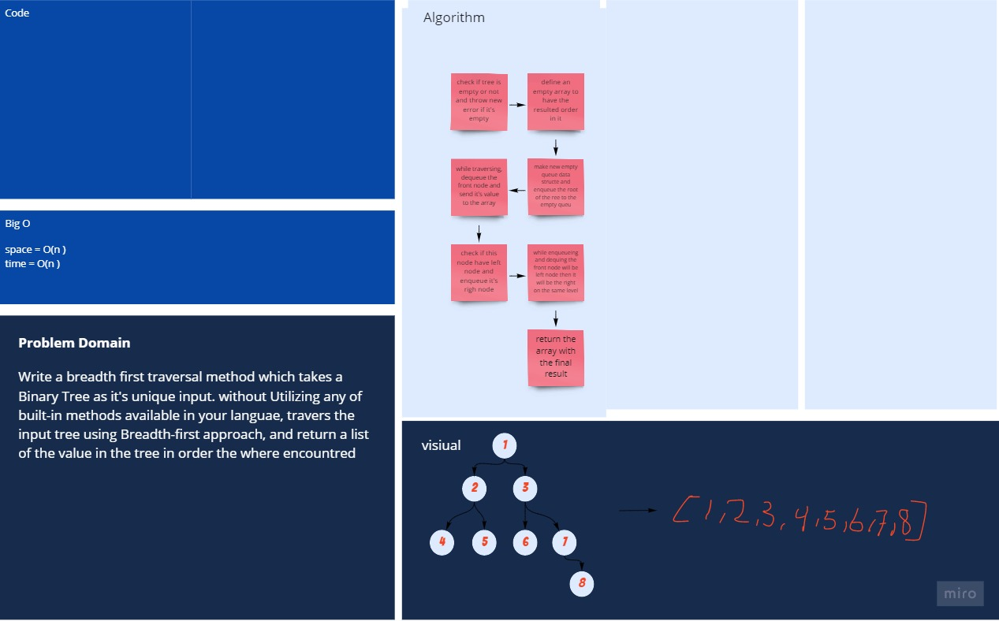

# Binary Trees & Binary Search Trees

## Challenge

Write a breadth first traversal method which takes a Binary Tree as its unique input. Without utilizing any of the built-in methods available to your language, traverse the input tree using a Breadth-first approach, and return a list of the values in the tree in the order they were encountered.

## Approach & Efficiency

- Space : O(n)
- Time : O(n)

## white Board

[better view](https://miro.com/app/board/o9J_lAdcJfw=/)
