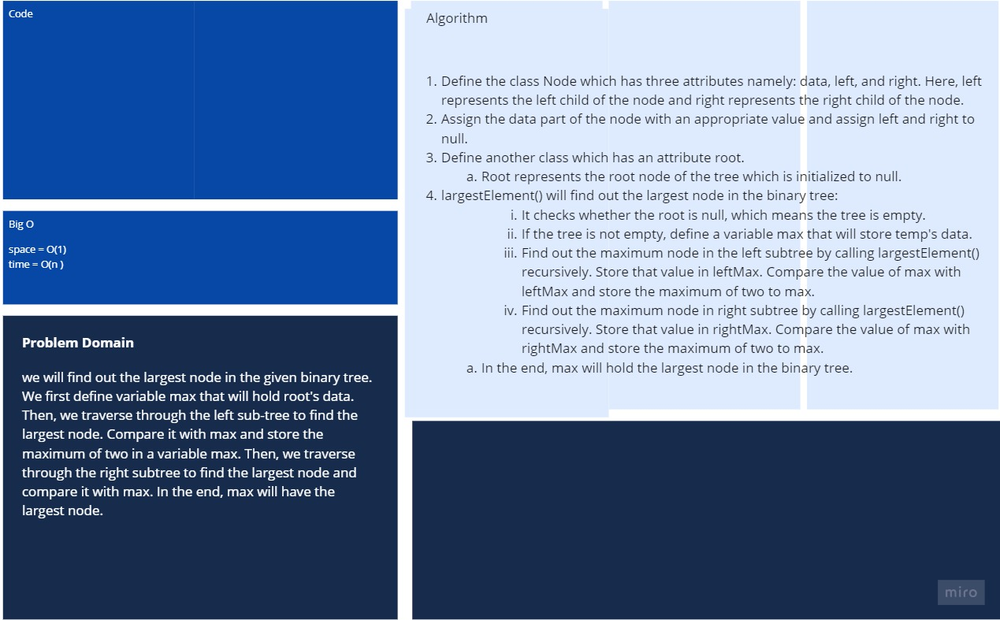

# Binary Trees & Binary Search Trees

## Challenge

In this program, we will find out the largest node in the given binary tree. We first define variable max that will hold root's data. Then, we traverse through the left sub-tree to find the largest node. Compare it with max and store the maximum of two in a variable max. Then, we traverse through the right subtree to find the largest node and compare it with max. In the end, max will have the largest node.

## Approach & Efficiency

- Space : O(1)
- Time : O(n)

## white Board

[better view](https://miro.com/app/board/o9J_lA46VaM=/)
