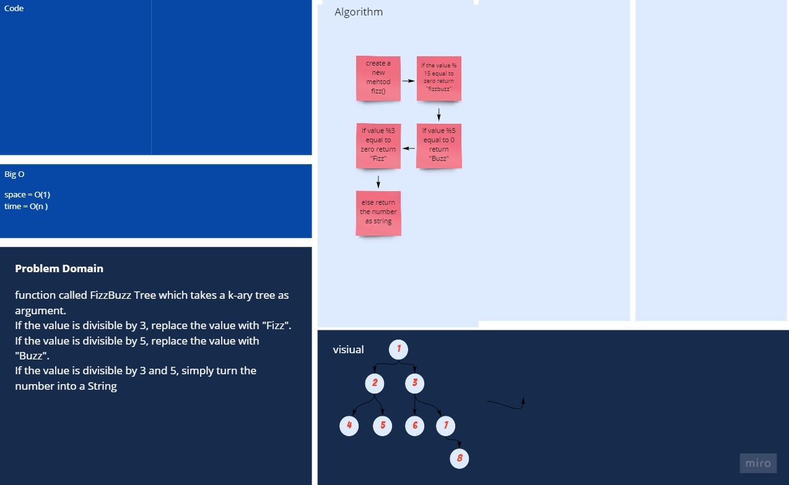

# Fizz Buzz challenge

## Challenge

Ask the Candidate the following question:

You are working with a file structure with only at most 2 files or folder. Each file directory has either one or two folders/files.

Comparing two file different file directories, create a method that takes in 2 directory structures and compares both and determines whether or not they have the same number of individual files.

## Approach & Efficiency

- Space : O(1)
- Time : O(n)

## white Board

[better view](https://miro.com/app/board/o9J_lAbVeg0=/)
